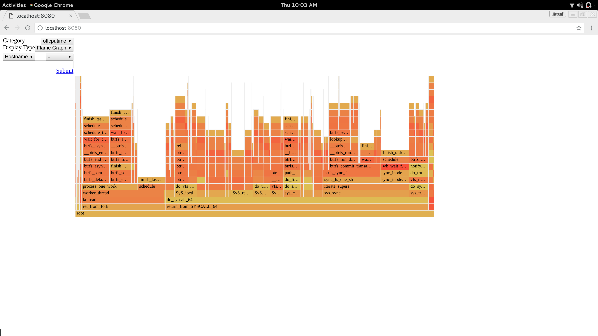
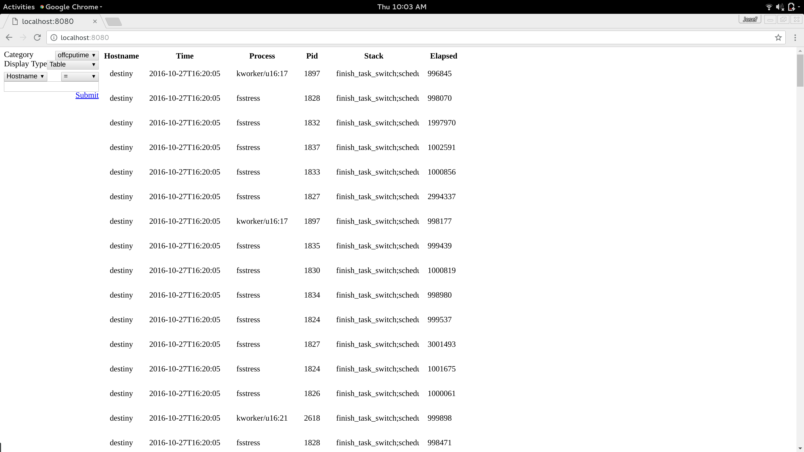

A service for logging and visualizing data from bpf scripts.




# Setup the database

For sqllite you do the following

```
cat kernelscope-sqlite.sql | sqllite3 yourdatabase.db
```

For mysql you can just run the following

```
mysql -u username -p < kernelscope-mysql.sql
```

# Start the logging daemon

This is the daemon that accepts connections from your hosts that want to log
their trace data.  You need to point it at your database, the sqllite and mysql
commands follow (use whichever one is relevant)

```
python KernelscopeService.py --mysql localhost --dbuser user --dbpassword password --dbname kernelscope 8080
python KernelscopeLoggerService.py --sqlite kernelscope.db 8081
```


# Run the tracing tool on your target host

Currently the only script in this repo is offcputime.py, which is just Brendan
Gregg's offcputime.py from bcc/tools/offcputime.py that has been modified to
dump it's information into a kernelscope service.  You run it as follows

```
python offcputime.py --logger 'http://localhost:8080' --threshold 5000
```

This will log to the service running on localhost and will only log events that
take longer than 5000 microseconds, and will send information to the service
once a minute.

# Run the visualization service

This is the read-only side of kernelscope that runs the webapp.  Simply run the
following command for whichever database backend you are using

```
python KernelscopeService.py --mysql localhost --dbuser user --dbpassword password --dbname kernelscope 8080
python KernelscopeService.py --sqlite kernelscope.db 8080
```

and then navigate your browser to the appropriate host and port.

# Extending for new data types

This is meant to be as easily extendable as possible.  That said I, a kernel
developer, wrote it so it made sense to me.  If there are cleaner approaches I
accept patches.  All you should have to do is add entry to two dicts at the top
of src/KernelscopeCategories.py.  The format is the following

```
_categories['DATABASE TABLE NAME'] = [ {'name': 'COLUMN NAME 1', 'type':'TYPE', 'prettyname':'SOME PRETTY NAME TO DESCRIBE THE COLUMN'}]
```

TYPE has to be of one of the types described in json-api.txt.  _valid_columns
must be just a dict of the tables column names, so in the following format

```
_valid_columns['DATABASE TABLE NAME'] = [ 'COLUMN NAME 1', 'COLUMN NAME 2' ]
```

Then your script can log with the proper dict values set and it'll log into the
datbase properly and then the webapp should show the data properly.
